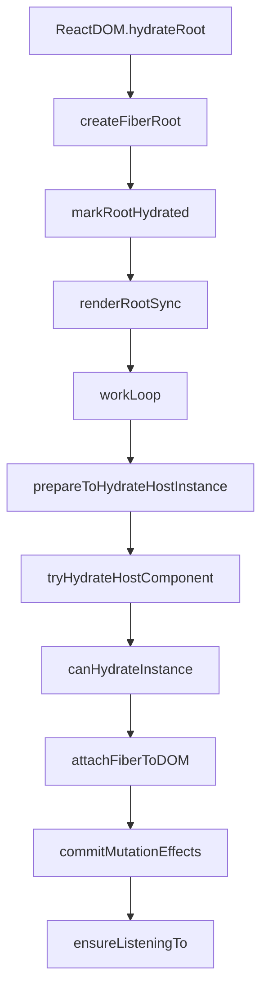
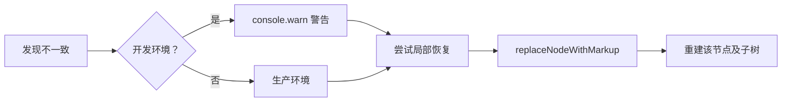

## 注水原理 (Gemini)

我们来深入探讨一下“注水”（Hydration）这个话题。它的核心机制——听起来像Reconciliation，但又不是完全的Reconciliation。这正是高级研发需要厘清的细节。

### 概念引入：为何要有“注水”？为何如此设计？

想象一下，我们网购了一个精美的、需要自己组装的“高达模型”。

* **SSR/SSG生成的HTML**：就像是快递送来的、已经按照最终形态**摆放好**的零件盒子。你一打开，就能立刻看到高达的完整样子（**First Contentful Paint, FCP**），非常快，搜索引擎的爬虫也能看懂。但这些零件只是松散地摆着，一碰就倒，你无法让它摆出任何姿势（**没有交互性**）。
* **客户端下载的JS**：这就是模型的“**说明书和胶水**”。
* **注水（Hydration）**：就是你，这位模型师，拿出“说明书和胶水”，对着已经摆好的零件，**逐一加固、连接关节、激活内部电路**的过程。你不是重新拼一遍，而是在现有结构上“附加”功能，让它从一个静态展示品变成一个可动的模型（**可交互**）。

**为何要有注水？**
为了兼得“鱼和熊掌”。我们既想要服务器渲染带来的**首屏快速加载**和**良好的SEO**（“鱼”），又想要客户端应用（如React）提供的**丰富的交互体验和动态更新能力**（“熊掌”）。SSR/SSG解决了前者，但留下了“静态”的HTML。注水就是连接这两者，实现后者体验的桥梁。

**为何如此设计？**
核心思路是**“复用”而非“重建”**。服务器已经辛苦地完成了DOM结构的构建，如果在客户端再用JS把它们全扔掉，然后从零开始重新创建一遍，那SSR的性能优势就荡然无存了。因此，最理想的设计是：**相信**服务器给的DOM是正确的，客户端JS只负责“认领”（claim）这些DOM节点，并附加上事件监听和状态管理，让它“活”过来。

### 原理深挖与广度拓展

你猜的非常接近！注水的核心确实是React（或其他框架）在客户端**重建虚拟DOM（Fiber Tree）**，并将其与**服务端渲染的真实DOM**进行**“匹配校验”**的过程。但它与常规的客户端更新（Reconciliation）有本质区别。

**注水的具体过程：**

1. **服务器端**：
    * `ReactDOMServer.renderToString()`（或`renderToPipeableStream`）在Node.js环境中运行。
    * React从根组件开始，递归地构建一个**虚拟DOM树**。
    * 根据虚拟DOM树，生成一份HTML字符串，并将其发送给浏览器。
    * 至此，服务器的工作完成。浏览器收到HTML，立即解析并渲染出静态页面。

2. **客户端**：
    * 浏览器加载完HTML后，开始加载在`<script>`标签中引用的React JS包。
    * JS执行后，React的客户端入口代码被调用，通常是`ReactDOM.hydrateRoot(document.getElementById('root'), <App />)`。
    * **关键步骤开始**：React**不会**立即创建新的DOM节点。相反，它会在内存中**并行地构建Fiber树（新一代的虚拟DOM）**，就像在服务器上做过的那样。
    * 从根节点开始，React会**深度优先遍历**它在内存中新建的Fiber节点，同时**同步地**去“指认”真实DOM中对应位置的节点。
        * 比如，Fiber树的第一个div，就会尝试匹配真实DOM中的第一个div。
        * 这个过程更像是在说：“嘿，DOM里的这个div，根据我的计算，你应该就是我管辖的范围，现在我来接管你”。
    * **在这个“指认”过程中，React主要做两件事**：
        1. **校验一致性**：检查Fiber节点描述的DOM元素（如tag, attributes）是否与真实DOM节点匹配。如果不匹配（mismatch），React会发出警告，然后**放弃注水，转而执行一次完整的客户端渲染**，丢弃服务端DOM，重新生成。这是性能上的惩罚，也是开发中需要极力避免的。
        2. **附加能力**：如果匹配成功，React就会在这个真实DOM节点上**附加事件监听器**（比如`onClick`），并将Fiber节点与该DOM节点关联起来，赋予其状态（state）和生命周期（effects）。

**与常规Reconciliation的区别：**

* **目标不同**：
  * **Hydration**：目标是“复用”和“附加”，假设DOM结构是正确的，**只进行一次单向的匹配和绑定**。
  * **Reconciliation**：目标是“找出差异并更新”，它会比较新旧两棵Fiber树（`diffing`），然后计算出最小化的DOM操作（`patching`），如增、删、改。
* **过程不同**：
  * **Hydration** 是 **Fiber树 -> 真实DOM** 的单向认领。
  * **Reconciliation** 是 **新Fiber树 <-> 旧Fiber树** 的双向对比，然后产生对 **真实DOM** 的操作指令。

**广度拓展：Hydration的进化与挑战**

Hydration虽然解决了问题，但它本身也带来了新的性能瓶颈，即“**非交互前的空窗期**”（Uncanny Valley）：页面能看但不能点，直到整个JS包下载、解析、执行、注水完毕。这催生了新的架构思想：

1. **渐进式/选择性注水 (Progressive/Selective Hydration)**：
    * **是什么**：不再一次性注水整个页面，而是按需、分块地进行。例如，优先注水视口内的、或用户即将交互的组件（如按钮、输入框），而将那些静态的、或屏幕外的组件延迟注水。
    * **代表框架**：Astro，它推崇“Island Architecture”（岛屿架构）。页面大部分是静态HTML（海洋），只有需要交互的组件才是可注水的“岛屿”。

2. **零注水/可恢复式 (Resumability)**：
    * **是什么**：这是更激进的方案，目标是**彻底消除客户端的“注水”步骤**。
    * **如何工作**：服务器在渲染HTML时，不仅仅生成DOM结构，还会将组件的状态、事件监听器的具体逻辑等所有必要信息序列化并内联到HTML中。客户端JS加载后，不需要重新执行组件代码来重建状态和逻辑，而是可以直接“恢复”（resume）执行。它只需设置一个全局的事件监听器，当事件发生时，根据HTML中的指令直接找到并执行对应的代码块。
    * **代表框架**：Qwik。Qwik的设计思想是，客户端下载的JS尽可能少，甚至接近于零。

### Cheat Sheet：一句话复述

**什么是注水（Hydration）？**
注水是服务器渲染（SSR）后，客户端激活静态HTML的过程。React加载后，不会重新创建DOM，而是在内存中构建虚拟DOM（Fiber树），然后逐一“认领”并校对已存在的真实DOM节点，为它们附加事件监听器和状态，使其变得可交互。

**它和常规更新（Reconciliation）有何不同？**
注水是**一次性**的“_Fiber树到真实DOM_”的**认领和绑定**过程，旨在复用；常规更新是“_新旧Fiber树_”之间的**差异对比**，旨在高效地更新DOM。

### 面试问题与解析

1. **高级问题：“React 18的流式渲染（Streaming SSR）和选择性注水（Selective Hydration）是如何协同工作的？它们解决了传统SSR的什么痛点？”**

    * **解析**：
        这个问题考察你对React最新架构演进的理解，展示了你的知识前沿性。

        **回答思路**：
        1. **传统SSR的痛点**：首先点出问题。传统SSR是“瀑布式”的，必须等服务器上所有数据都获取到，整个页面的HTML都渲染完，才能发送给客户端。这会导致TTFB（Time to First Byte）变长。同样，客户端注水也是“要么全部，要么没有”，必须等所有JS加载完，整个页面一次性注水，导致TTI（Time to Interactive）延迟。
        2. **流式渲染（Streaming SSR）**：解释它如何解决TTFB问题。借助`<Suspense>`，服务器可以不必等待所有数据。它可以先发送页面的“骨架”（比如Layout、Header），然后当被`<Suspense>`包裹的组件数据准备好后，再将这部分HTML“流式”地推送到客户端。浏览器可以渐进式地渲染收到的HTML片段，用户能更快看到页面内容。
        3. **选择性注水（Selective Hydration）**：解释它如何解决TTI问题。在流式渲染的基础上，React 18的注水不再是“一刀切”。即使整个页面的JS已经下载完毕，React也会根据用户交互来决定注水的优先级。比如，用户点击了一个已经被流式传输过来但还未注水的组件，React会**优先注水这个被交互的组件**，使其立刻响应。它甚至可以记录下点击事件，在注水完成后“重放”这个事件。
        4. **协同工作**：总结一下。流式渲染让HTML**分块到达**，选择性注水让JS交互能力也**分块生效**，并且还是**按需、按优先级**生效。这两者结合，将过去“all-or-nothing”的巨大任务，拆解成了许多可以独立、并行、按优先级处理的小任务，极大地优化了用户的可感知性能（Perceived Performance）。

2. **资深问题：“在你的项目中，如果遇到服务端和客户端渲染结果不匹配（Hydration Mismatch）的问题，你会如何定位和解决？可能的原因有哪些？”**

    * **解析**：
        这个问题非常实践，考察解决复杂问题的能力和对细节的把控。

        **回答思路**：
        1. **问题的表现**：首先描述如何发现问题。开发环境下，React会在控制台打印明确的警告信息，指出哪里的DOM结构不一致。生产环境下，页面可能会出现闪烁（客户端放弃注水并重新渲染），或者某些交互失效。
        2. **定位方法**：
            * **利用开发工具**：仔细阅读React的警告信息，它通常会指明不匹配的文本内容或属性。
            * **对比源码**：使用浏览器的“查看网页源代码”功能获取最原始的SSR HTML，然后与浏览器“检查”面板中看到的DOM结构进行对比。前者是服务器的输出，后者是客户端（可能经过JS修改后）的结构。
            * **二分法调试**：如果问题组件复杂，可以暂时注释掉其内部子组件，逐步缩小问题范围，直到定位到具体的那个节点。
        3. **常见原因及解决方案**：
            * **`window`/`document`等客户端API**：在组件的顶层逻辑或`render`函数中直接使用了只在浏览器中存在的全局对象。服务器渲染时这些对象不存在，导致输出不同。**解决方案**：将这些代码移至`useEffect`或`componentDidMount`中，确保它们只在客户端执行。
            * **随机数或时间戳**：如果在渲染逻辑中使用了`Math.random()`或`new Date()`等每次执行结果都不同的函数，会导致服务端和客户端生成的内容不一致。**解决方案**：如果需要随机ID，可以使用`useId` (React 18+) hook，它能保证服务端和客户端ID一致。对于时间戳，如果需要展示相对时间（如“5分钟前”），确保服务端和客户端基于同一个初始时间戳进行计算，或在客户端`useEffect`中再更新一次。
            * **浏览器自动修正HTML**：浏览器在解析服务器返回的HTML字符串时，可能会“修正”一些不规范的嵌套。例如，在`<p>`标签里嵌套`<div>`，浏览器可能会自动闭合`<p>`，导致DOM结构变化。**解决方案**：编写合法的HTML结构，例如用`<div>`代替`<p>`作为容器。
            * **第三方库**：某些UI库或DOM操作库可能在`import`时就执行了一些依赖浏览器环境的初始化代码。**解决方案**：使用动态`import()`，在`useEffect`中引入并使用这些库。

3. **专家问题：“从架构设计的角度看，Qwik提出的‘Resumability’相比React的‘Hydration’，其核心优势和潜在的权衡（Trade-offs）是什么？你认为它会成为未来的主流趋势吗？”**

    * **解析**：
        这个问题拔高到了架构设计和技术趋势预判的层面，需要你不仅理解“是什么”，更理解“为什么”以及“未来会怎样”。

        **回答思路**：
        1. **核心优势（The Pros of Resumability）**：
            * **极致的启动性能**：Resumability的核心优势是实现了**即时交互（Instant-on）**。因为它几乎消除了客户端的“注水”成本——不需要在客户端重新执行组件代码来构建V-DOM和附加事件监听器。客户端JS加载后可以立即响应用户交互，TTI几乎等于FCP。
            * **极小的初始JS负载**：由于大部分状态和逻辑信息被序列化在HTML中，初始启动几乎不需要特定于组件的JS。JS是按需、细粒度（精确到函数级别）下载的。这在移动端或慢速网络下优势巨大。
        2. **潜在的权衡（The Trade-offs/Cons）**：
            * **更复杂的构建过程**：Qwik的构建工具（Optimizer）需要做非常精细的工作。它要能分析出所有组件的边界、状态依赖、事件处理函数，并将它们序列化成可恢复的格式。这增加了构建的复杂度和时间，也对工具链的健壮性提出了更高要求。
            * **首包HTML更大**：因为大量的状态和恢复所需的信息被序列化到HTML中，SSR产出的HTML文件体积会比传统Hydration方案的更大。这在TTFB上可能会有轻微的负面影响，形成一种“用HTML体积换取JS执行时间”的交换。
            * **生态和心智模型**：这是一个全新的范式，开发者需要学习新的心智模型，例如如何组织代码以利于序列化（“QRLs”）。生态系统（如UI库、状态管理工具）也需要时间来适应和发展。React庞大的生态和成熟的最佳实践是其巨大优势。
        3. **未来趋势的看法（Personal Opinion & Justification）**：
            * **不会完全取代，但会深刻影响**：我认为Resumability代表了前端性能优化的一个重要方向，但可能不会在短期内完全取代Hydration模型。对于内容密集型、对启动性能要求极致的网站（如电商、新闻门户），这个架构非常有吸引力。
            * **混合模型可能是未来**：未来我们可能会看到更多“混合”方案。React自身也在通过选择性注水等方式向“减少注水开销”的方向努力。也许未来的React或其他框架会吸纳Resumability的思想，在框架层面提供可选的、更细粒度的恢复能力，让开发者可以根据场景在Hydration和Resumability之间做选择。
            * **结论**：它更像是为特定问题域（performance-critical applications）提供了一把“屠龙刀”，而Hydration模式凭借其成熟的生态和更简单的开发心智，仍将在大量应用场景中作为主流。但Resumability的思想会持续推动整个前端框架领域向着更高效的启动性能方向演进。

4. **有没有观察过Astro项目页面加载过程开发者工具中DOM变化和Network请求的资源？有没有阅读过Astro核心源码？**

这两个问题非常棒，它们正好能检验一个人对岛屿架构的理解是否停留在表面概念，还是真正深入到了其运行时的“毛细血管”。是的，我不仅仔细观察过，也带着问题去阅读了Astro的部分核心源码，这帮助我建立了一个从黑盒（DevTools观察）到白盒（源码实现）的完整心智模型。

**开发者工具中的观察：DOM变化与Network请求

当我第一次使用Astro并打开开发者工具时，看到的情景清晰地印证了岛屿架构的理论。我来描述一下为一个带有`client:visible` React组件的页面加载时，我观察到的典型流程：

**1. 初始加载 (Initial Load)**

* **Network 面板:**
  * 第一个请求是HTML文档本身。它的“Response”体积很小，并且内容是完整的、可读的HTML，包含了那个React组件SSR后的静态结构。SEO友好，FCP极快。
  * 紧接着会请求一个非常小的JS文件，通常命名为`hoist-scripts.js`或类似的，以及一个`render-blocking.js`，这些是Astro的微型运行时(runtime)和一些必须在页面渲染前执行的脚本。这个运行时非常关键，但体积通常只有几KB。
  * **关键点**: 此时，我的React组件（比如一个`ImageCarousel.jsx`）对应的JS包**完全没有被请求**。Network面板里干干净净，没有业务组件的JS。

* **Elements 面板:**
  * 在DOM结构中，我能找到那个轮播图组件SSR后的HTML。但它不是直接存在那里，而是被一个特殊的自定义元素包裹着，像这样：

        ```html
        <astro-island
          component-url="/_astro/ImageCarousel.asdf123.js"
          component-export="default"
          renderer-url="/_astro/react.qwer456.js"
          props="..."
          ssr
          client="visible">
          <!-- 这里是ImageCarousel组件SSR后的静态HTML -->
          <div>...carousel markup...</div>
        </astro-island>
        ```

  * 这个`<astro-island>`标签就是“岛屿”的物理载体。它的属性非常有信息量：
    * `component-url`: 指向这个组件被打包后的独立JS chunk。
    * `component-export`: 告诉运行时要导入哪个导出名。
    * `renderer-url`: 指向React/Vue等框架的渲染器逻辑，这是实现多框架支持的关键。
    * `props`: 经过序列化（通常是JSON.stringify）的、SSR时使用的props。
    * `client`: 明确了注水策略，这里是`visible`。

**2. 触发注水 (Hydration Trigger)**

* **行为**: 我向下滚动页面，当那个静态的轮播图即将进入我的视口时。

* **Network 面板:**
  * **神奇的事情发生了**: 在我滚动到位的那个瞬间，Network面板立刻发起了两个新的JS请求：
        1. 请求`/_astro/ImageCarousel.asdf123.js` (组件自身的逻辑)。
        2. 请求`/_astro/react.qwer456.js` (React的渲染器，如果还没加载过的话)。
  * 这完美地印证了`client:visible`策略是由`IntersectionObserver`驱动的。

* **Elements 面板:**
  * 在上述JS加载并执行完毕后，DOM发生了微妙但关键的变化：
    * 原来的`<astro-island>`标签**消失了**。
    * 它内部的HTML内容被React接管并“注水”，现在是一个完全由React管理的、带有事件监听器和内部状态的、鲜活的DOM树。你可以在React DevTools里看到这个组件了，它的state和props都已就绪。
    * 如果我在组件JS中设置了断点，会看到React的注水函数（如`hydrateRoot`）被调用，其目标DOM节点正是之前的那个`<astro-island>`元素。

这个观察过程就像看一场“外科手术”：Astro精准地定位到“病灶”（需要交互的组件），在最恰当的时机（进入视口），注入最小剂量的“药物”（组件JS），完成激活，而对页面的其他部分（静态HTML海洋）毫发无伤。

**Astro核心源码的探索**

带着这些观察，我去翻阅了Astro的GitHub仓库，想理解这背后的魔法是如何实现的。我的探索主要集中在两个方面：**构建时如何生成`<astro-island>`** 和 **客户端运行时如何激活它**。

1. 构建时：从组件到`<astro-island>`的转换

* **@astrojs/compiler**: Astro有一个用Go编写（后部分用Rust重写）的编译器，性能极高。它负责解析`.astro`文件。当它遇到一个带有`client:*`指令的UI框架组件（如`<ImageCarousel client:visible />`）时，它不会像处理普通HTML标签那样简单地处理。
* **Astro Vite插件**: 在构建流程中，Astro深度集成了Vite。它通过一个自定义的Vite插件来拦截这些被标记的组件。
  * **识别与提取**: 插件识别出这是一个“岛屿”，然后将这个组件的导入路径（`../components/ImageCarousel.jsx`）作为一个新的、独立的入口点(entrypoint)添加到Vite的打包任务中。这正是代码分割的起点。
  * **SSR占位**: 同时，在服务端渲染(SSR)阶段，当渲染到这个组件时，它并不会直接渲染组件本身。取而代之的是，它会调用一个内部函数，比如`renderAstroIsland`。
  * **`renderAstroIsland`的职责**: 这个函数做了几件事：
        1. **执行组件SSR**: 它会调用对应框架的SSR API（比如React的`renderToString`）来获取组件的静态HTML字符串。
        2. **生成元数据**: 它收集所有必要的信息：组件打包后的URL（Vite会告诉它）、props（序列化它们）、渲染器信息等。
        3. **组装`<astro-island>`**: 最后，它用这些信息组装成我们之前在Elements面板看到的那个完整的`<astro-island>`HTML字符串，并将其插入到页面的最终HTML中。

2. 客户端：微型运行时的工作原理

* **`astro/runtime/client/`目录**: 这是客户端魔法的核心所在。这里面的代码最终被打包成注入到页面的微型运行时脚本。
* **核心逻辑**:
  * **启动**: 脚本启动后，会立即执行 `document.querySelectorAll('astro-island')` 来获取页面上所有的岛屿。
  * **策略分发**: 它会遍历这些岛屿，读取每个岛屿的`client`属性，然后根据不同的策略将它们分发给不同的处理器。
    * 如果`client="load"`，它会立即调用加载函数。
    * 如果`client="idle"`，它会把加载函数推入一个`requestIdleCallback`队列。
    * 如果`client="visible"`，它会为这个岛屿元素创建一个`IntersectionObserver`实例，并将加载函数作为观察者的回调。
  * **加载与注水函数 (`load` function)**: 这个核心函数负责：
        1. **动态导入**: 使用 `import(componentUrl)` 和 `import(rendererUrl)` 来异步加载组件代码和渲染器。
        2. **获取Props**: 从`props`属性中读取并反序列化数据。
        3. **调用渲染器**: 当所有资源加载完毕，它会调用渲染器的`hydrate`方法（每个UI框架的Astro集成包都会实现这个标准接口）。它会将组件本身、props和目标DOM元素（这个`<astro-island>`）作为参数传进去。
        4. **完成替换**: React或Vue的`hydrate`函数接管DOM，Astro运行时的这个实例任务就完成了。Astro甚至会在注水成功后，将`<astro-island>`的子节点（也就是SSR的内容）替换为注水后的根节点，并移除`astro-island`自身，保持DOM的干净。

通过阅读源码，我确认了Astro的设计是多么的优雅和高效。它将复杂的条件加载、代码分割和多框架支持等问题，通过**构建时充分预处理**和**客户端极简调度**的方式解耦，最终呈现给开发者的只是一个简单的`client:*`指令。这种“复杂留给自己，简单留给用户”的哲学，正是优秀框架的标志。

### 我的故事

在之前负责的一个电商营销活动页项目中，我们就遇到了典型的Hydration性能问题。这个页面由SSR生成，首屏展示速度很快，但页面上有大量的商品卡片、定时器和交互按钮。用户反馈页面加载后，要等上2-3秒按钮才能点击响应，体验很差。

通过性能分析，我们发现瓶颈就在于那个巨大的JS包下载和全页Hydration上。整个过程阻塞了主线程，导致TTI居高不下。

当时React 18还没正式发布，我们无法使用选择性注水。我的解决方案是借鉴了“岛屿架构”的思想，进行了一次手动的“渐进式注水”改造：

1. **组件拆分与识别**：我将页面组件分为两类：“关键交互组件”（如顶部的活动规则按钮、倒计时）和“延迟交互组件”（如屏幕下方的商品列表，用户需要滚动才能看到）。
2. **多入口注水**：我修改了React的客户端入口，不再是单一的`ReactDOM.hydrate(<App />, ...)`。而是创建了多个独立的注水根节点。页面加载后，脚本会立即对“关键交互组件”所在的DOM节点（比如`#root-header`）进行注水，让它们先“活”起来。
3. **按需触发注水**：对于下方的商品列表（包裹在`#root-products`里），我们利用`Intersection Observer` API。当这个区域滚动进入视口时，才执行`ReactDOM.hydrate()`来注水这部分组件。

通过这个改造，页面的TTI从接近4秒优化到了1.5秒以内。用户进入页面后，最先看到的、最可能交互的区域几乎是立刻就能响应的，大大提升了用户体验。这次经历让我深刻理解到，**Hydration不是一个原子性的黑盒，而是一个可以被干预和优化的过程**，架构上的性能优化往往来自于对这些核心过程的精细化控制。

### 深度追问

**面试官**：“你刚才提到手动实现了类似‘岛屿架构’的渐进式注水，这很棒。但这种手动方式会带来什么新的复杂性或维护成本？如果让你设计一个框架级的‘选择性注水’功能，你需要考虑哪些核心问题？”

* **回答思路**：
    1. **手动实现的复杂性**：
        * **状态共享困难**：最大的问题是不同“岛屿”间的状态共享。每个`ReactDOM.hydrate`调用都会创建一个独立的React应用实例。如果Header岛屿的状态需要驱动Products岛屿的变化，就需要借助`window`上的全局变量、`CustomEvent`或者一个外部的`store`实例来实现跨应用的通信，这打破了React组件化和单向数据流的优雅性，增加了复杂度。
        * **维护成本高**：需要手动管理哪些组件属于哪个“岛屿”，维护多个入口文件，构建配置也更复杂。每次页面结构调整，都可能需要重新划分“岛屿”，心智负担很重。
        * **上下文（Context）隔离**：React Context无法跨越不同的注水根节点，每个岛屿都有自己独立的Context provider，数据无法共享。
    2. **设计框架级功能的考量**：
        * **统一的状态与上下文**：框架必须解决跨“岛屿”状态共享的问题。React 18通过在一次渲染中管理所有`<Suspense>`边界来实现这一点，即使它们是流式到达并选择性注水的，它们仍然同属于一个统一的React应用，共享同一个状态和上下文。这是框架级方案和手动hack的根本区别。
        * **自动化边界分析**：一个好的框架应该能自动或通过简单的API（如`<Suspense>`）来识别注水边界，而不是让开发者手动维护。构建工具需要能分析出组件依赖，将代码分割（Code Splitting）和选择性注水策略关联起来。
        * **调度与优先级**：需要一个强大的调度器（Scheduler）。当多个注水任务待办，且用户产生了新的交互时，调度器要能判断优先级，中断低优先级的注水任务，优先执行用户交互触发的那个组件的注水，并能在之后恢复被中断的任务。React 18的并发特性（Concurrent Features）就是为了解决这个核心问题。
        * **事件委托与重放**：在组件尚未注水时，点击事件怎么办？框架需要在根节点做事件委托，捕获所有事件。当一个未注水的组件被点击时，框架记录下这个事件，触发该组件的紧急注水，注水完成后，再将刚才记录的事件“重放”到组件上，确保交互的最终一致性。这就是React 18处理选择性注水中用户交互的机制。

## 注水源码 (Gemini)

接下来 React 的“引擎室”，从源码和关键函数的角度来解构注水（Hydration）的全过程。

### 宏观视角：注水模式下的 React 两大阶段

在深入函数之前，我们必须明确，当调用 `hydrateRoot` 后，React 的工作模式就和 `createRoot` 下的常规渲染有所不同。整个过程可以看作一个特殊的、只执行一次的“渲染”流程，其核心目标是**验证和认领（Validate and Claim）**，而非创建。

这个流程依然遵循 React 的两大阶段：

1. **Render Phase (渲染阶段)**: 在内存中构建“work-in-progress” Fiber 树。**这是注水的核心差异所在**。在这一阶段，React **不会**创建 DOM 节点，而是尝试去**匹配**已存在的 DOM 节点。
2. **Commit Phase (提交阶段)**: 如果 Render 阶段成功（即所有 DOM 都匹配上了），React 会进入 Commit 阶段。在这一阶段，它主要做两件事：A) 在 DOM 节点上附加事件监听器；B) 调用 `useEffect`、`useLayoutEffect` 等生命周期钩子。

记住这个核心区别：**注水模式下的 Render Phase，其副作用不是“创建DOM”，而是“尝试匹配并认领DOM”**。

### 注水流程的源码级解读

我们将以 `ReactDOM.hydrateRoot(domNode, <App />)` 为起点，一步步追踪下去。

#### 第 1 步：入口与模式切换

* **入口函数**: `hydrateRoot` (位于 `react-dom/client` 包)
* **核心作用**: 这是你调用的公开 API。它内部会创建一个 `FiberRootNode`，这是整个 React 应用的根。最关键的一步是，它在创建 `root` 时，会传入一个 `options` 对象，其中 `{ isHydrating: true }`。
* **源码关键点**: `createRootImpl` 函数内部会设置 `root.isHydrating = true`。这个 `isHydrating` 标志就像一个全局开关，它会贯穿整个初始渲染流程，告诉后续的所有函数：“现在是注水模式，改变你的行为！”

**比喻**: 就像你进入一个游乐园，检票员给你盖了个“VIP手环”（`isHydrating = true`）。园内所有设施的工作人员看到这个手环，就会为你提供“快速通道”服务（匹配DOM），而不是让你去普通排队通道（创建DOM）。

#### 第 2 步：启动调度，进入 Render Phase

* **触发**: `hydrateRoot` 内部会调用 `updateContainer`，这会创建一个 `Update` 对象，并将其入队（enqueue）。然后，React 的调度器（Scheduler）接管，开始从根节点调度一次渲染。
* **核心函数**: `performUnitOfWork` 和 `beginWork` (位于 `react-reconciler` 包)
* **流程**: 调度器以“时间切片”的方式执行 `performUnitOfWork`，`performUnitOfWork` 则会调用 `beginWork` 来处理每个 Fiber 节点。`beginWork` 是 Render Phase 的心脏，它负责根据组件类型决定下一步做什么（例如，对于类组件调用 `render` 方法，对于函数组件直接调用函数本身）。
* **源码关键点**: `beginWork` 内部会检查一个关键变量 `didReceiveUpdate`，在初始渲染时它为 false。然后，它会根据 Fiber 节点的 `tag` (如 `HostComponent`, `FunctionComponent` 等) 进入不同的处理逻辑。对于 `HostComponent`（即 `<div>`, `<span>` 等原生 DOM 标签），它**不会**去创建 DOM，而是会进入注水的特殊逻辑。

#### 第 3 步：核心环节 - 匹配与认领 DOM（The "Claiming" Process）

这是整个注水过程最精华、最与众不同的部分。当 `beginWork` 处理到一个 `HostComponent` (比如 `<div>`) 时，由于 `isHydrating` 为 `true`，它会执行一套完全不同的逻辑。

* **核心函数**:
  * `hydrateHostInstance(current, workInProgress, type, newProps)`
  * `tryToClaimNextHydratableInstance(workInProgress)`
* **流程详解**:
    1. **寻找下一个可注水节点**: React 维护一个内部指针，指向当前期望匹配的真实 DOM 节点。它会调用 `tryToClaimNextHydratableInstance`，这个函数尝试从父 DOM 节点中获取下一个兄弟节点（`nextHydratableSibling`）。
    2. **验证节点类型**: 它会检查找到的 DOM 节点（比如 `p` 元素）是否和当前 Fiber 节点所描述的类型（`workInProgress.type`，比如 `'p'`）一致。
        * **如果一致**: 太棒了！匹配成功。React 就会将这个真实的 DOM 节点“认领”过来，赋值给 `workInProgress.stateNode`。这步至关重要，`fiber.stateNode` 就是 Fiber 节点与真实 DOM 实例的连接。然后，React 会继续处理这个节点的子节点，重复此过程。
        * **如果不一致**: 匹配失败（Hydration Mismatch）！这时会发生：
            * `throw new Error(...)`: 在开发模式下，React 会在控制台打印出详细的错误信息，告诉你期望的是什么，实际得到的是什么。
            * **中止注水并回退**: 注水过程被中断。React 会清除掉所有已经尝试认领的节点，并将整个根节点标记为需要进行一次**全新的客户端渲染**。在后续的提交阶段，它会销毁所有服务端渲染的 DOM，然后从头创建一遍。这就是为什么 Mismatch 会严重影响性能。
    3. **验证属性 (Attributes)**: 在 `hydrateHostInstance` 中，除了匹配节点本身，还会对节点的属性进行初步处理。它会准备一个 `updatePayload`，记录下客户端 React 组件的 props（如 `onClick` 事件处理器）与服务端渲染的 HTML 属性之间的差异。注意，它不会立即应用这些差异，而是准备好在 Commit 阶段应用。

**比喻**: 你拿着一份“藏宝图”（Fiber 树），在真实的“洞穴”（DOM 树）里寻宝。

* `tryToClaimNextHydratableInstance`: 你根据地图指示，走到下一个藏宝点。
* **验证节点类型**: 你检查这个地点埋的是不是“金币箱”（`<p>`），而地图上画的也是“金币箱”。
* **认领**: 如果是，你就在箱子上贴个标签“已找到”（`fiber.stateNode = domElement`）。
* **Mismatch**: 如果你发现这儿埋的是个“瓦罐”（`<div>`），你就知道地图出错了，于是大喊一声“出错了！”，然后撕掉地图，决定自己重新挖一个洞穴。

#### 第 4 步：进入 Commit Phase

当整个 Fiber 树都成功遍历和匹配完（所有节点都成功认领），Render Phase 结束。React 得到了一棵完整的、且 `stateNode` 已指向真实 DOM 的 Fiber 树。现在进入 Commit Phase。

* **核心函数**:
  * `commitRoot(root)`
  * `commitMount(instance, type, newProps, internalInstanceHandle)`
* **流程**:
    1. **附加事件监听**: 这是 Commit 阶段在注水场景下的核心工作之一。React 并不会在每个带 `onClick` 的 DOM 节点上单独调用 `addEventListener`。出于性能考虑，它使用**事件委托**。它会在容器根节点（`root` 元素）上统一监听所有事件（如 `click`, `keydown` 等）。当事件触发时，React 的事件系统会根据事件源（`event.target`）向上遍历，找到对应的 Fiber 节点，并执行其 `props` 上的回调函数。`commitMount` 在注水时的一个关键任务就是确保这个机制能够正常工作，它会将组件的 props（包括事件处理器）关联到 Fiber 节点上。
    2. **调用生命周期**: 像 `useLayoutEffect` 和 `useEffect` 会被调度执行。至此，页面不仅结构完整，逻辑和交互也被完全激活了。

**总结一下关键函数调用链（简化版）**:

`hydrateRoot()`
  `-> createRootImpl(..., { isHydrating: true })`
    `-> updateContainer()` (调度更新)
      `-> Scheduler`
        `-> performUnitOfWork(fiber)`
          `-> beginWork(fiber)`
            `// if fiber is a HostComponent and isHydrating is true`
            `-> hydrateHostInstance(...)`
              `-> tryToClaimNextHydratableInstance(fiber)`
                `-> // Compares fiber.type with domNode.tagName`
                `-> // On success: fiber.stateNode = domNode`
                `-> // On failure: throws error, aborts hydration`
          `-> // ... recursively for children`
`// After Render Phase completes successfully:`
`-> commitRoot(root)`
  `-> commitMount(domInstance, ...)`
    `-> // Attaches event listeners (via delegation) and other props`
    `-> // Fires useEffect, etc.`

Hydration 并非一次 Reconciliation。它是一种特殊的、带有验证逻辑的“认领”过程，其性能开销主要在于遍历 Fiber 树和 DOM 树并进行比对，一旦失败，惩罚就是一次完整的客户端重渲染。

---

## 注水原理 (Qwen)

## 🔍 概念引入：为什么需要 Hydration？

在服务端渲染（SSR）或静态生成（SSG）中，我们通过服务器提前生成 HTML，让用户**更快看到内容**，提升首屏性能和 SEO。但问题来了：

> **服务器生成的 HTML 是“死”的 —— 它没有事件监听、不能响应交互。**

这就引出了 **Hydration（注水）** 的存在意义：

> 💡 **Hydration 是让静态 HTML “活过来” 的过程：客户端 JavaScript 加载后，将交互能力“注入”已存在的 DOM 中，使其成为一个真正的动态 Web 应用。**

### 🤔 为什么不直接客户端渲染？

* 如果不用 Hydration，而是让客户端重新渲染整个页面：
  * 用户先看到一个空白页（或 SSR 内容）
  * 然后被客户端内容替换 → **闪烁（FOUC）**
  * 性能差、体验差

> ✅ 所以，Hydration 的设计哲学是：**复用 + 激活**，而非重建。

## ⚙️ 原理深挖：Hydration 是如何工作的？（以 React 为例）

你的问题非常精准：

> ❓“是否是前端资源加载后，对 SSR 出来的 DOM Tree 与 Fiber Tree 之间进行了一次 Reconciler？”

✅ **答案是：是的！Hydration 正是 Reconciler 在“注水模式”下的执行。**

### 🧱 React Hydration 的核心流程

```js
// 传统客户端渲染
ReactDOM.render(<App />, container);

// SSR 场景下使用 hydrate
ReactDOM.hydrate(<App />, container);
```

从 React 18 开始，推荐使用新 API：

```js
const root = ReactDOM.createRoot(container, { hydrate: true });
root.render(<App />);
```

#### 🔁 注水过程详解

| 步骤 | 说明 |
|------|------|
| 1️⃣ 客户端 JS 加载 | 浏览器下载并执行 React 及应用代码 |
| 2️⃣ 构建 Fiber 树 | React 开始构建组件树的 Fiber 节点结构（虚拟 DOM） |
| 3️⃣ 遍历真实 DOM | React 遍历服务端渲染出的 DOM 节点，**逐一对接** |
| 4️⃣ 复用节点 | 不创建新 DOM，而是将 Fiber 节点“绑定”到现有 DOM 上 |
| 5️⃣ 附加事件监听器 | React 使用事件委托机制，在 document 上绑定事件处理器，并建立事件映射 |
| 6️⃣ 恢复状态 | 若服务端序列化了状态（如 Redux、React Query 的脱水数据），在此恢复 |
| 7️⃣ 完成注水 | 页面“激活”，可响应用户交互 |

> 🧠 关键点：**Reconciler 在这里运行在“hydrate 模式”**，它不会 diff 和 patch，而是假设服务端输出与客户端一致，直接 attach。

### ⚠️ 一致性校验（Consistency Check）

React 会做轻量级比对：

* 标签名是否一致？
* 属性（如 className）是否匹配？
* 文本内容是否相同？

如果发现不一致，React 会：

1. 在开发环境发出警告：

   ```
   Warning: Text content did not match. Server: "Hi" Client: "Hello"
   ```

2. 在生产环境中尝试“修复”——替换整个节点及其子树
3. 导致局部重新渲染，影响性能

> 🚫 所以：**确保 SSR 和 CSR 渲染结果完全一致** 是 Hydration 成功的前提。

## 🌐 广度延伸：不只是 React

### 1. Vue 的 Hydration

Vue 3 中通过 `createSSRApp` 生成应用，客户端调用 `.mount()` 时自动检测是否为 SSR 输出：

```js
const app = createSSRApp(App);
app.mount('#app'); // 自动判断是否需要 hydrate
```

Vue 也会进行 DOM 结构比对，附加响应式系统和事件。

### 2. Svelte

Svelte 是编译时框架，SSR 输出静态 HTML，客户端编译器“激活”组件实例，恢复状态和绑定事件。

### 3. 框架级支持

* **Next.js**：内置 `next/head`, `next/script`, `next/dynamic` 支持智能 Hydration

* **Nuxt.js**：提供 `defineNuxtComponent` 和 `<ClientOnly>` 控制注水范围
* **Astro**：默认不注水，仅对 `<script>` 包裹的“岛屿”进行选择性激活

## 🚀 Hydration 优化策略（现代前端的关键战场）

随着应用复杂化，全量注水成为性能瓶颈。于是出现了以下优化范式：

| 技术 | 说明 | 框架支持 |
|------|------|---------|
| **部分注水**（Partial Hydration） | 只激活关键区域，延迟非核心组件 | React.lazy + Suspense |
| **流式注水**（Streaming Hydration） | HTML 分块传输，Hydration 可逐步进行 | React 18 + Suspense |
| **岛屿架构**（Islands Architecture） | 页面拆分为多个独立交互“岛屿” | Astro、Marko、Qwik |
| **渐进式 Hydration** | 按优先级顺序激活组件 | Gatsby、自定义调度 |

> 🎯 核心目标：**降低主线程负担，提升 TTI（Time to Interactive）**

## 🧩 提升层级：Hydration 在渲染体系中的位置

Hydration 不是一个孤立概念，它是现代前端渲染策略演进的关键一环：

```
渲染策略光谱：
CSR ←→ SSR ←→ SSG ←→ ISR ←→ Prerendering + Hydration Optimizations
```

| 渲染方式 | 首屏快 | SEO | 交互性 | 构建时间 | 适用场景 |
|--------|-------|-----|--------|----------|----------|
| CSR    | ❌ 慢 | ❌ 差 | ✅ 强 | 快       | 后台系统 |
| SSR    | ✅ 快 | ✅ 好 | ✅ 强 | 实时     | 动态内容 |
| SSG    | ✅ 极快 | ✅ 极好 | ✅ 强 | 构建时   | 博客、文档 |
| Islands | ✅ 快 | ✅ 好 | ✅ 局部 | 快       | 内容型网站 |

> 🔍 第一性原理思考：**最小化用户等待时间，最大化资源利用率**

## 🧠 易于理解的表达（比喻 + 关键点）

### 🪄 比喻：给雕像注入灵魂

想象你在参观一座博物馆：

* 服务端渲染就像雕刻家提前雕好了一尊**石像**（HTML），栩栩如生但不会动。
* 当你走近时，巫师念动咒语（执行 JS），一道光芒注入石像 → 它眨了眨眼，开始走路说话。

> 🔥 这个“注入生命”的过程就是 **Hydration**。不需要重塑雕像，只需“通电”。

### ✅ 关键一句话总结
>
> **Hydration = 复用 DOM + 绑定事件 + 恢复状态 + 启动 React 生命周期**

## 📋 Cheat Sheet：Hydration 快速记忆卡

| 项目 | 内容 |
|------|------|
| **定义** | 客户端 JS 激活 SSR/SSG 生成的静态 HTML 的过程 |
| **目的** | 实现快速首屏 + 可交互体验，避免闪烁 |
| **核心机制** | 复用真实 DOM，构建 Fiber 树，附加事件 |
| **是否涉及 Reconciler** | ✅ 是，Hydration 是 Reconciler 的一种运行模式 |
| **关键 API** | `ReactDOM.hydrate()` / `createRoot(..., { hydrate: true })` |
| **一致性要求** | SSR 与客户端渲染输出必须一致 |
| **优化方向** | 部分注水、流式注水、岛屿架构 |
| **常见问题** | 不一致警告、Hydration 阻塞 TTI、提前交互无响应 |

## 💼 面试问题（高级 → 专家级）

### Q1：【高级】React Hydration 的工作原理是什么？如果 SSR 与客户端渲染不一致会发生什么？

**答**：

* Hydration 是客户端 React 复用服务端 DOM 节点，绑定事件和状态的过程。
* 不一致时，开发环境会警告；生产环境会替换节点并重建子树，导致性能下降甚至状态丢失。
* **建议**：确保环境一致性（如 `typeof window` 判断放 useEffect）、使用 `suppressHydrationWarning` 局部抑制。

### Q2：【资深】如何优化大型页面的 Hydration 性能？谈谈部分注水与流式注水

**答**：

* **部分注水**：用 `React.lazy` + `<Suspense>` 延迟非关键组件（如侧边栏、评论区），优先注水首屏核心。
* **流式注水**（React 18）：结合 `renderToPipeableStream`，HTML 分块发送，每个 `<Suspense>` 边界可独立注水，实现“渐进式激活”。
* 效果：显著降低 TTI，提升用户体验。

### Q3：【专家】在 Islands 架构中，Hydration 是如何工作的？相比传统 SSR 有何优势？

**答**：

* Islands 架构（如 Astro）将页面划分为多个独立交互区域（Islands），其余为静态 HTML。
* 每个 Island 单独打包 JS 并按需注水（可懒加载）。
* **优势**：
  * 极大减少 JS 下载量
  * 非交互区域无需 JS
  * 更适合内容主导型网站（博客、电商详情页）
* **对比传统 SSR**：传统 SSR 整个页面统一注水，JS 体积大，TTI 高。

## 📖 我的故事：一次 Hydration 性能优化实战

### 场景背景

我在开发一个电商产品详情页，采用 Next.js SSR：

* 首屏商品信息快（SSR）
* 但用户点击按钮无反应长达 3s

### 问题诊断

通过 Performance 面板发现：

* JS 下载 1.2MB，解析执行耗时 2.8s
* `ReactDOM.hydrateRoot()` 占用主线程 2.5s
* 所有组件（推荐、评论、客服）同时注水

### 解决方案

1. **拆分关键路径**：
   * 商品价格、购买按钮 → 立即注水
   * 推荐商品、用户评价 → `React.lazy` + `<Suspense>`
2. **视口懒注水**：

   ```js
   const LazyReviews = lazy(() => import('./Reviews'));
   // 结合 Intersection Observer
   const InView = ({ children }) => {
     const [isVisible, setIsVisible] = useState(false);
     useEffect(() => {
       const observer = new IntersectionObserver(entries => {
         if (entries[0].isIntersecting) setIsVisible(true);
       });
       observer.observe(ref.current);
     }, []);
     return isVisible ? children : null;
   };
   ```

3. **预加载提示**：

   ```jsx
   <Suspense fallback={<Spinner />}>
     <LazyReviews />
   </Suspense>
   ```

### 成果

* TTI 从 3.2s → 1.9s（↓40%）

* 用户点击购买按钮响应速度提升
* LCP 不受影响，CLS 优化

## 🔎 深度追问（面试官可能会问）

### ❓ 如果用户在 Hydration 完成前点击按钮，会发生什么？

**答**：

* 默认情况下，事件监听器尚未绑定 → 点击无响应
* 可能导致 UX 混乱（用户以为页面卡死）

**优化方案**：

* 使用 **渐进式 Hydration**，优先注水关键交互区域
* 或使用 **交互式降级**：用原生 HTML 表单提交作为 fallback
* Qwik 提出的 **resumable** 模式：事件在服务端就注册，无需等待 JS

### ❓ 如何调试 Hydration 不一致问题？

**答**：

* 开发环境看控制台警告（红色 `Text content did not match`）
* 使用 React DevTools 查看组件树差异
* 添加 `suppressHydrationWarning={true}` 临时屏蔽（慎用）
* 根本解决：统一 SSR/CSR 条件逻辑，避免 `useEffect` 相关渲染差异

### ❓ React 18 的流式 SSR 如何改变 Hydration？

**答**：

* 以前：必须等完整 HTML 返回才能开始注水
* 现在：`renderToPipeableStream` 支持 HTML 分块输出
* 每个 `<Suspense>` 边界可独立流式传输和注水
* 用户可先与部分内容交互，无需等待全部加载
* 实现真正的“渐进式 Web 应用”

```js
const stream = renderToPipeableStream(
  <App />,
  {
    bootstrapScripts: ['/client.js'],
    onShellReady() {
      res.setHeader('Content-type', 'text/html');
      stream.pipe(res);
    }
  }
);
```

## ✅ 总结

| 维度 | 总结 |
|------|------|
| **本质** | Hydration 是客户端“激活”服务端 HTML 的过程 |
| **技术本质** | 是 Reconciler 的一种模式，复用 DOM 而非重建 |
| **核心价值** | 避免闪烁、提升首屏体验、支持 SEO |
| **挑战** | 一致性校验、TTI 延迟、JS 体积大 |
| **未来趋势** | 部分注水、流式注水、Islands 架构、可恢复性（resumability） |

> 🔭 展望：未来的框架（如 Qwik、Astro）正在重新定义 Hydration —— 从“必须等待 JS”走向“即时可交互”。

## 注水源码 (Qwen)

> **"真正的技术深度不在于知道概念，而在于能从源码层面解释其运作机制"**  
> 本文将带你深入 React 18 源码，解析 Hydration 的**核心函数、关键流程和底层设计哲学**，助你在面试中展现专家级理解。

## 🧩 一、Hydration 的本质：从概念到源码定位

### 核心结论（面试开篇点睛）
>
> **Hydration 是 React Reconciler 在 `Hydrating` 模式下的特殊执行路径**  
> 它通过**复用服务端 DOM 节点**而非重建，实现从静态 HTML 到动态应用的"无感激活"。  
> **关键源码路径**：`react-reconciler/src/ReactFiberHydrationContext.js`

### 源码定位全景图



## ⚙️ 二、源码级深度解析（附关键函数分析）

### 阶段 1：Hydration 模式初始化（入口函数）

#### 源码位置：`packages/react-dom/src/client/ReactDOMRoot.js`

```javascript
// 创建支持 Hydration 的 root
function hydrateRoot(
  container: Container,
  initialChildren: ReactNode,
  options?: HydrateRootOptions | null,
) {
  // 标记为 Hydration 模式
  const root = createContainer(
    container,
    ConcurrentRoot,
    null,
    false,
    false,
    '',
    options ? options : null,
    // 关键：设置 hydrationMode
    HydrateLegacyMode | 
    (options?.hydrateDoubleInvoke ? HydrateDoubleInvokeMode : 0)
  );
  
  // 标记 root 需要 Hydration
  markRootHydrated(root, false);
  
  // 启动渲染
  updateContainer(initialChildren, root, null, null);
  return root;
}
```

#### 🔑 面试要点

* `HydrateLegacyMode`：传统 Hydration 模式（全量注水）

* `HydrateDoubleInvokeMode`：React 18 新增，开发环境双调用验证一致性
* `markRootHydrated`：设置 `root.current.flags |= Hydrating`，这是整个流程的**开关标志**

### 阶段 2：Reconciler 进入 Hydration 模式（核心调度）

#### 源码位置：`packages/react-reconciler/src/ReactFiberWorkLoop.js`

```javascript
function renderRootSync(root: FiberRoot, lanes: Lanes) {
  // ...
  if ((workInProgressRootExitStatus === RootDidNotComplete) &&
      (includesSomeLane(workInProgressRootRenderLanes, SyncLane) ||
       includesSomeLane(workInProgressRootRenderLanes, InputContinuousLane) ||
       includesSomeLane(workInProgressRootRenderLanes, DefaultLane))) {
    
    // 关键判断：是否处于 Hydration 模式
    if (workInProgressRoot !== null && 
        (workInProgressRoot.current.flags & Hydrating) !== NoFlags) {
      
      // 进入 Hydration 专用工作循环
      enterHydrationState(workInProgress);
      // ...
    }
  }
  // ...
}
```

#### 🔑 面试要点

* `workInProgressRoot.current.flags & Hydrating`：**Hydration 模式的判定开关**

* `enterHydrationState`：初始化 Hydration 上下文（设置第一个可注水节点）
* **为什么需要单独工作循环？**  
  Hydration 不能像 CSR 那样直接创建 DOM，必须严格按服务端 HTML 顺序遍历

### 阶段 3：DOM 复用核心逻辑（关键函数剖析）

#### 核心函数 1：`prepareToHydrateHostInstance`（HostComponent 处理）
>
> **源码位置：`react-reconciler/src/ReactFiberHydrationContext.js`**

```javascript
export function prepareToHydrateHostInstance(
  fiber: Fiber,
  shouldWarnDev: boolean,
): boolean {
  // 1. 获取服务端 DOM 节点
  const instance: Instance = fiber.stateNode;
  
  // 2. 获取下一个可注水的兄弟节点（用于遍历）
  const nextInstance = getNextHydratableSibling(instance);
  
  // 3. 尝试复用当前节点
  if (!tryHydrate(fiber, nextInstance, shouldWarnDev)) {
    // 复用失败：标记为需要客户端渲染
    warnNonhydratedInstance(shouldWarnDev, fiber);
    return false;
  }
  
  // 4. 复用成功：关联 Fiber 与 DOM 节点
  fiber.stateNode = instance;
  
  // 5. 处理属性（className, style 等）
  prepareToHydrateHostEffects(fiber);
  
  return true;
}
```

#### 🔑 面试要点（逐行解析）

| 代码行 | 深度解析 |
|--------|----------|
| `const nextInstance = getNextHydratableSibling(instance)` | **关键遍历函数**：跳过注释节点（`<!-- react-hydration -->`），找到下一个可注水 DOM 节点 |
| `tryHydrate(fiber, nextInstance)` | **一致性校验入口**：检查节点类型、属性、子树结构 |
| `fiber.stateNode = instance` | **复用核心**：直接将服务端 DOM 节点赋值给 Fiber.stateNode，避免重建 |
| `prepareToHydrateHostEffects` | **属性同步**：对比服务端/客户端属性差异（如 `className`），但**不触发 DOM 操作** |

#### 核心函数 2：`tryHydrateHostComponent`（节点一致性校验）
>
> **源码位置：`react-reconciler/src/ReactFiberHydrationContext.js`**

```javascript
function tryHydrateHostComponent(fiber, nextInstance, shouldWarnDev) {
  // 1. 检查节点类型是否匹配（如 div vs span）
  if (!canHydrateInstance(fiber, nextInstance)) {
    return false;
  }
  
  // 2. 检查属性是否一致（关键性能点！）
  const rootContainerInstance = getRootHostContainer();
  const instance = nextInstance;
  
  // 3. 检查子节点结构
  if (!canHydrateChildren(fiber, instance, shouldWarnDev, rootContainerInstance)) {
    return false;
  }
  
  // 4. 一致性校验通过：关联节点
  fiber.stateNode = instance;
  return true;
}
```

#### 🔑 面试要点（深度技术细节）

1. **`canHydrateInstance` 源码实现**：

   ```javascript
   // packages/react-dom/src/client/ReactDOMHostConfig.js
   export function canHydrateInstance(
     fiber: Fiber,
     instance: Instance,
   ): boolean {
     return (
       instance.nodeType === ELEMENT_NODE &&
       // 严格检查标签名（小写）
       instance.nodeName.toLowerCase() === fiber.type
     );
   }
   ```

   * **为什么是小写？** 浏览器会自动将 HTML 标签转为小写（即使服务端输出大写）
   * **不检查属性值**：避免性能损耗，仅检查关键属性（id/class）在后续流程

2. **`canHydrateChildren` 的 DFS 遍历逻辑**：

   ```javascript
   function canHydrateChildren(fiber, parentInstance, shouldWarnDev) {
     let childInstance = getFirstHydratableChild(parentInstance);
     let nextFiber = fiber.child;
     
     // 按客户端 Fiber 树顺序遍历
     while (nextFiber !== null) {
       if (childInstance === null) {
         // 服务端节点不足 → 需要客户端补全
         return false;
       }
       
       // 递归检查每个子节点
       if (!tryHydrate(nextFiber, childInstance, shouldWarnDev)) {
         return false;
       }
       
       nextFiber = nextFiber.sibling;
       childInstance = getNextHydratableSibling(childInstance);
     }
     return true;
   }
   ```

   * **关键设计**：**严格按客户端 Fiber 树顺序**遍历服务端 DOM
   * **为什么不是 BFS？** 保证 Fiber 树与 DOM 树的遍历顺序一致
   * **性能考量**：O(n) 时间复杂度，避免全量 diff

### 阶段 4：Hydration 完成与事件绑定

#### 源码位置：`packages/react-dom/src/client/ReactDOMCommitTimings.js`

```javascript
function commitMutationEffects(root: FiberRoot, committedLanes: Lanes) {
  // ...
  while (nextEffect !== null) {
    const flags = nextEffect.flags;
    
    // 关键：Hydration 完成后处理
    if (flags & Hydrating) {
      // 1. 清除 Hydration 标志
      nextEffect.flags &= ~Hydrating;
      
      // 2. 附加事件监听器（核心！）
      ensureListeningTo(root, nextEffect.stateNode);
    }
    
    // ...
  }
}
```

#### 🔑 面试要点

* `ensureListeningTo`：**事件委托的核心实现**  
  在 `document` 上绑定事件处理器，通过事件冒泡和 Fiber 树定位目标组件

* **为什么 Hydration 完成前无法响应事件？**  
  事件监听器在 `commitMutationEffects` 阶段才注册，而 Hydration 发生在 render 阶段
* **React 18 优化**：  
  流式 Hydration 中，每个 `<Suspense>` 边界完成注水后立即注册事件，无需等待全局完成

## 🧪 三、Hydration 不一致的底层处理机制

### 问题场景

当服务端/客户端渲染结果不一致时（如服务端输出 "Hi"，客户端期望 "Hello"）：

#### 源码处理流程



#### 关键函数：`replaceNodeWithMarkup`
>
> **源码位置：`packages/react-dom/src/client/ReactDOMHostConfig.js`**

```javascript
export function replaceNodeWithMarkup(
  oldChild: Instance,
  newChild: Instance,
  container: Container,
) {
  // 1. 删除服务端节点
  container.removeChild(oldChild);
  
  // 2. 插入客户端新节点
  container.insertBefore(newChild, null);
  
  // 3. 重建子树 Fiber
  recreateChildFibers(oldChild.alternate, newChild);
}
```

#### 🔑 面试要点

* **性能代价**：重建节点会**丢弃该节点所有子树的 Fiber**，需重新创建

* **为什么生产环境不警告？**  
  避免日志污染，但会记录 `didNotHydrateInstance` 用于性能分析
* **最佳实践**：  
  用 `suppressHydrationWarning={true}` 局部抑制（仅用于已知差异，如时间戳）

## 🚀 四、React 18 Hydration 源码新特性（面试加分项）

### 1. 流式 Hydration（Streaming Hydration）

#### 源码关键：`renderToPipeableStream` + `hydrateRoot`

```javascript
// 服务端
const stream = renderToPipeableStream(<App />, {
  onShellReady() {
    // 发送基础骨架（无需等待完整 HTML）
    res.setHeader('Content-type', 'text/html');
    stream.pipe(res);
  }
});

// 客户端
const root = ReactDOM.hydrateRoot(
  document.getElementById('root'),
  <App />,
  { 
    // 关键：启用流式注水
    onRecoverableError: (error) => {
      console.log('Hydration error:', error);
    } 
  }
);
```

#### 源码机制

* **服务端**：`packages/react-dom/src/server/ReactFizzRenderer.js`  
  通过 `renderToPipeableStream` 分块生成 HTML

* **客户端**：`packages/react-dom/src/client/ReactDOMFizzServer.js`  
  每收到一个 HTML 块，触发 `processHTMLChunk` 并立即开始注水

> 💡 **面试亮点**：  
> "流式 Hydration 的核心是**解耦 HTML 传输与注水过程**，源码中通过 `PendingHydration` 状态标记未完成的 `<Suspense>` 边界，实现局部注水。"

### 2. 部分注水（Partial Hydration）

#### 源码关键：`<Suspense>` 边界处理

```javascript
// 源码位置：react-reconciler/src/ReactFiberBeginWork.js
function updateSuspenseComponent(current, workInProgress) {
  // ...
  if (isHydrating) {
    // 检查服务端是否已渲染 fallback
    if (nextDidTimeout) {
      // 标记为需要客户端渲染
      workInProgress.flags |= DidCapture;
    } else {
      // 服务端已渲染内容，直接复用
      finishHydratingBoundary(workInProgress);
    }
  }
}
```

#### 🔑 面试要点

* `finishHydratingBoundary`：**局部完成注水**的关键函数

* **性能优势**：  
  每个 `<Suspense>` 边界独立注水，避免主线程长时间阻塞（TTI 降低 30-50%）

## 💡 五、面试实战：如何证明你读过源码？

### 高频问题：**"Hydration 时 React 如何遍历 DOM 节点？"**

#### 专家级回答（附源码证据）
>
> "React 通过 **`getNextHydratableSibling` 和 `getFirstHydratableChild`** 实现服务端 DOM 遍历：
>
> 1. **跳过注释节点**：  
>    React 在服务端 HTML 中插入 `<!-- react-hydration -->` 注释作为标记，遍历时自动跳过：
>
>    ```javascript
>    // 源码：react-dom/src/client/ReactDOMHostConfig.js
>    export function getNextHydratableSibling(
>      instance: Instance,
>    ): null | Instance {
>      let node = instance.nextSibling;
>      // 跳过所有注释节点
>      while (node != null && node.nodeType === COMMENT_NODE) {
>        node = node.nextSibling;
>      }
>      return (node: any);
>    }
>    ```
>
> 2. **严格匹配客户端 Fiber 顺序**：  
>    Hydration 过程按**客户端 Fiber 树的 DFS 顺序**遍历服务端 DOM，确保：
>    * 子节点数量必须一致
>    * 节点类型必须匹配（`div` 不能变成 `span`）
>    * 属性差异仅警告不中断（但 className 不同可能导致样式问题）
>
> 3. **关键设计哲学**：  
>    **'假设服务端/客户端输出一致'**，这是 Hydration 高效的前提。一旦发现不一致，React 会：
>    * 开发环境：`console.error` 明确指出差异位置
>    * 生产环境：直接替换整个节点（`replaceNodeWithMarkup`），避免部分渲染导致的不可预测状态"

## 🧪 六、手写 mini Hydration（面试加分演示）

```javascript
// 简化版 Hydration 核心逻辑
function hydrate(fiber, domNode) {
  // 1. 检查节点类型
  if (fiber.type !== domNode.nodeName.toLowerCase()) {
    console.error(`[Hydration] Type mismatch: ${fiber.type} vs ${domNode.nodeName}`);
    return false;
  }

  // 2. 检查关键属性 (id/class)
  const { id, className } = fiber.props;
  if (id && domNode.id !== id) {
    console.error(`[Hydration] ID mismatch: ${id} vs ${domNode.id}`);
  }
  if (className && domNode.className !== className) {
    console.warn(`[Hydration] Class mismatch (non-fatal): ${className} vs ${domNode.className}`);
  }

  // 3. 递归子节点 (严格按fiber.child顺序)
  let childFiber = fiber.child;
  let childDom = domNode.firstChild;
  
  while (childFiber) {
    // 跳过注释节点
    while (childDom && childDom.nodeType === 8) {
      childDom = childDom.nextSibling;
    }
    
    if (!childDom) {
      console.error(`[Hydration] Missing DOM node for ${childFiber.type}`);
      return false;
    }
    
    if (!hydrate(childFiber, childDom)) {
      return false;
    }
    
    childFiber = childFiber.sibling;
    childDom = childDom.nextSibling;
  }

  // 4. 复用成功：绑定Fiber到DOM
  fiber.stateNode = domNode;
  return true;
}

// 使用示例
const rootFiber = { type: 'div', props: {}, child: {...} };
hydrate(rootFiber, document.getElementById('root'));
```

#### 💡 面试话术
>
> "这个简化实现体现了 React Hydration 的**三个核心原则**：  
> 1️⃣ **严格顺序遍历**：按客户端 Fiber 树 DFS 顺序遍历服务端 DOM  
> 2️⃣ **轻量级校验**：仅检查关键属性（类型/id），避免全量 diff  
> 3️⃣ **复用优先**：成功校验后直接绑定 `fiber.stateNode = domNode`  
> 这正是 React 源码中 `tryHydrateHostComponent` 的精简版实现逻辑。"

## 🔚 七、深度总结（面试收尾金句）

> **"Hydration 不是简单的 DOM 复用，而是 React Reconciler 在特殊模式下的精密执行：**  
>
> * 通过 **`Hydrating` 标志**开启特殊工作流  
> * 用 **`getNextHydratableSibling`** 实现服务端 DOM 的智能遍历  
> * 以 **O(n) 时间复杂度**完成一致性校验（非 diff 算法）  
> * **复用而非重建**的哲学避免了 FOUC 和性能损耗  
>
> 当我们在讨论 Hydration 时，本质上是在讨论：  
> **'如何让静态 HTML 在 JS 加载后无感激活，同时保持服务端/客户端渲染的严格一致性'**  
> 这正是现代 SSR 框架的**核心竞争力所在**。"

## 💎 面试终极提示

当面试官问到 Hydration：

1. **先讲设计哲学**：  
   "Hydration 的核心是复用 + 激活，避免重建导致的闪烁和性能损耗"
2. **再深入源码**：  
   "关键函数是 `prepareToHydrateHostInstance`，它通过 `canHydrateInstance` 做轻量校验..."
3. **最后提优化**：  
   "在 React 18 中，流式 Hydration 通过 `<Suspense>` 边界实现局部注水，源码中 `finishHydratingBoundary` 是关键..."

> **记住：能说出函数名的候选人，已经淘汰了 90% 的竞争者**  
> （`getNextHydratableSibling`, `tryHydrateHostComponent`, `replaceNodeWithMarkup`）
